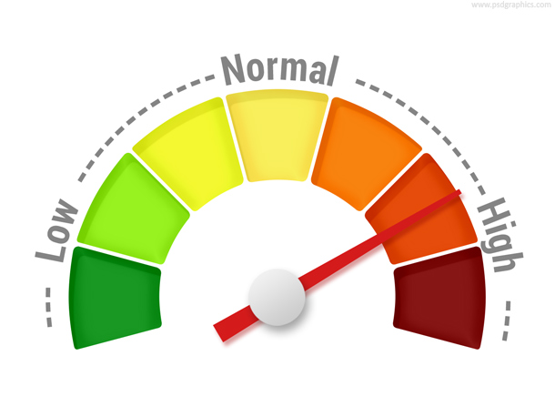

## AutoBench Features

- Automates benchmark runs when setup via CI/CD platform, like Netflix Spinnaker, AWS CodeDeploy.
- Identifies regression trends by comparing benchmark results with previous runs. 
- Helps compare performance of AWS cloud instances within and across instance families.
- Validates performance of OS. releases by running industry standard open source system benchmarks
- Runs SPECjvm2008 cpu intensive benchmarks to stress test various aspects of jvm or java applications
- Lists AWS cloud instance hardware configuation and instance features with benchmark results
- Benchmark results are accumulated in a shared directory (NFS) for ease of processing
- Results are aggregated and merged to allow comparison to be performed in a variety of ways.
- A single file to setup and execute all benchmarks
- A single configuration file (config.ini) for describing type of benchmark results to process
- Web interface. Home page: http://IP_Address/AMIbench/index.php

## AutoBench Design
AutoBench is built using open source phoronix test suite http://phoronix-test-suite.com benchmarking framework. There are ready to use benchmarks, called **test profiles**, available for running standard benchmarks like: openssl, 7zip-compress, Stream etc.. Framework is extensible that allows easy integration of custom benchmarks. Test profiles are stored in directory:**/var/lib/phoronix-test-suite/test-profiles**. Each test profile is configured using four files listed below:
- **downloads.xml (optional):**  instruction on downloading benchmark source code or binaries 
- **install.sh:** instructions on compiling, if required,  and installing benchmark 
- **test-definition.xml:** information about number of iterations, build dependencies, default options, measurement unit, supported OS, version etc.. is provided
- **results-definition.xml:** Benchmark output is filtered via unique pattern that fetches key metrics

Phoronix test suite is bundled with sensors or monitors for capturing useful metrics during benchmark run:
- **cpu monitor:** cpu usage
- **memory monitor:** memory usage
- **storage monitor:** storage throughput 
- **Linux perf and Flame Graph  monitors:** Linux perf metrics and flamegraph for highlighting hot cpu functions
- **performance/cost monitor:** Calculate performance per dollar. You can replace dollar with other units like: cpu, memory etc..

**Documentation: https://www.phoronix-test-suite.com/documentation/phoronix-test-suite.html**

All benchmarks are dumped into a shared NFS directory (prefered). Results are stored in seperate directories. For example directories:
- **cputests-openssl-190-i2-xlarge-LATEST:** Latest iteration of openssl cpu benchmark ran on AWS i2.xlarge instance 
- **cputests-openssl-190-i2-xlarge-440-96-generic-201803291856:** All previous iterations of the same test ran on i2.xlarge instance with date stamp 

memory (memtests-stream..) and java (javatests-java-cryto..) benchmarks also use similar directory names. Results are stored in **json, txt, css and svg** format.

## AutoBench Setup

- **setup.sh" script is provided to setup autobench. Script will install required packages. It is recommended to install in virtualbox VM. Script **setup.sh** will also install sample test reports that can be viewed via web brower by visiting url: http://ipaddress/AMIbench/index.php
- After **setup.sh** is finished. You can run benchmarks by executing: /usr/share/phoronix.runtest. Make sure to edit autobench environment file **/etc/autobench_environment.sh** if not running on a AWS cloud instance

## Autobench Benchark Suite
You can run all benchmarks by executing **/usr/share/phoronix.runtest** or run individually. For example:
**compress-7zip** benchmark is installed and executed in two steps:
  **$sudo /usr/bin/phoronix-test-suite-cputests install Test pts/compress-7zip-1.6.2**
  **$sudo /usr/bin/phoronix-test-suite-cputests batch-run Test pts/compress-7zip-1.6.2**

- **cpu benchmarks:** encode-mp3, ffmpeg, openssl, compress-7zip, sysbench-cpu, lmbench-mhz, kernel-build,
- **memory benchmarks:** cachebench, stream, stream-singlecpu,sysbench-mem,lmbench-mem, lmbench-bw
- **SPECjvm2008 benchmarks:** scimark-fft-large, cryto-aes, derby, compress, mpegaudio ...

## Autobench Reporting

