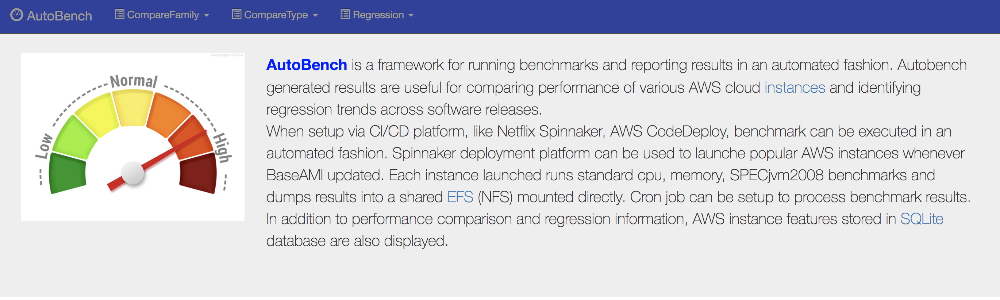
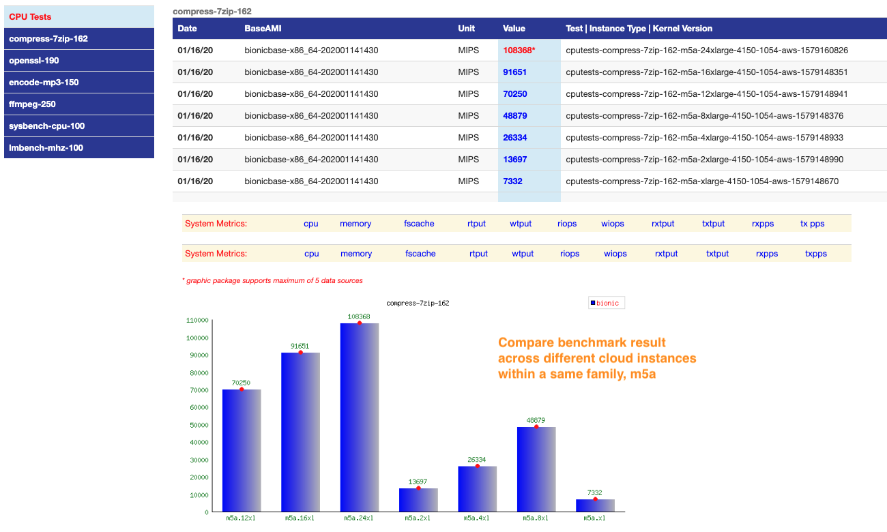
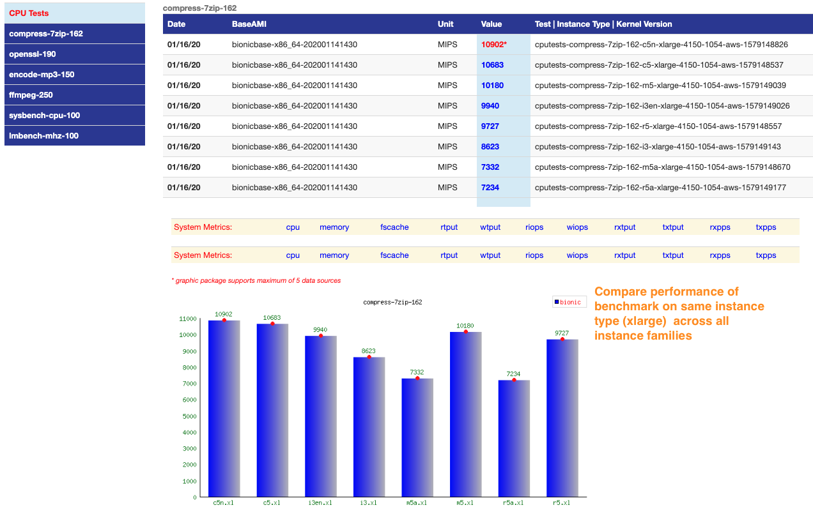
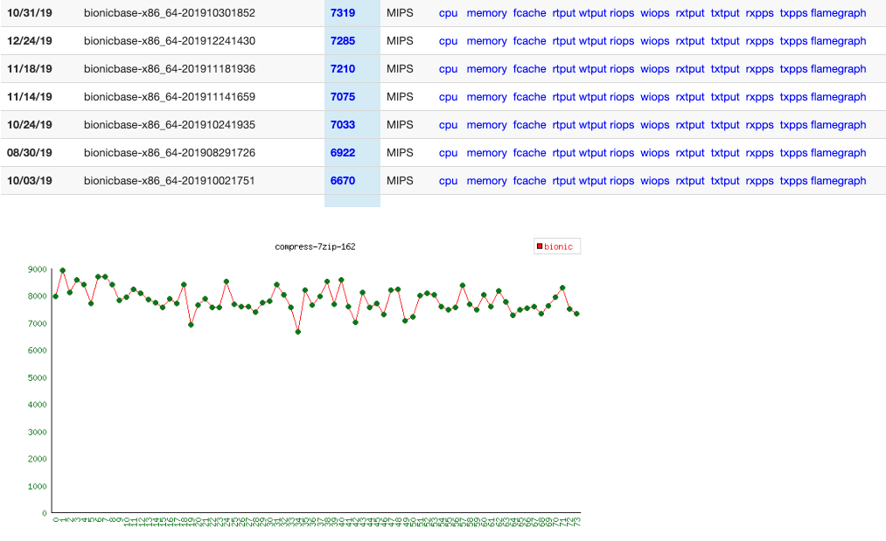

## AutoBench Features

- Automates running benchmarks when setup via CI/CD platform, like Netflix Spinnaker, AWS CodeDeploy.
- Reporting can also be automated by running it from the cron that generates fresh results and make it available via web
- Identifies regression trends by comparing benchmark results 
- Helps compare performance of AWS cloud instances within and across families and types.
- Run industry standard system, JVM and custom benchmarks
- All benchmark results are dumped into a shared directory (NFS) for ease of processing.
- Results are aggregated and merged to report performance differences across cloud families and types.
- A single file to execute benchmarks and process results.
- Reporting part generates all web pages and graphs and make them available at Home page: **http://ipaddress/AMIbench/index.php**
- Tested on Ubuntu xenial.

## AutoBench Design
Benchmarks are configured and exected via phoronix test suite http://phoronix-test-suite.com benchmarking framework. There are ready to use standard benchmarks available like: openssl, 7zip-compress, Stream etc.. One can also add customer benchmarks. Each benchmark configuration, called test profile, is stored in directory:**/var/lib/phoronix-test-suite/test-profiles**. Update files below when adding a new benchmarks:
- **downloads.xml (optional):**  Download instructions for downloading source code or required packages 
- **install.sh:** Instructions on compiling, if needed, and configuring benchmarks.  
- **test-definition.xml:** benchmarks attributes such as: iterations, build dependencies, descritpion, measurement unit, supported OS, version, etc..
- **results-definition.xml:** Benchmark test output is filtered to fetch a key metric, use for reporting results.

Type of benchmarks available:

- **cpu benchmarks:** encode-mp3, ffmpeg, openssl, compress-7zip, sysbench-cpu, lmbench-mhz, kernel-build,..
- **memory benchmarks:** cachebench, stream, stream-singlecpu, sysbench-mem, lmbench-mem, lmbench-bw
- **Storage benchmarks:**: fio to run: random and sequential read/write/mixed benchmarks
- **SPECjvm2008 benchmarks:** crypto,compress,mpegaudio, xml...

System metrics (cpu, memory, io, net) are collected as well as profiling data via linux perf. System usage are compared across cloud instances. Flamegraph and IPC/CPI (Instruction per cycle or cycles per instrunction) are also reported with results. 

All benchmarks are dumped into a shared NFS directory (prefered). Results are stored in seperate directories, for example:
- **cputests-openssl-190-i2-xlarge-LATEST:** Latest iteration of openssl cpu benchmark ran on AWS i2.xlarge instance 
- **cputests-openssl-190-i2-xlarge-440-96-generic-201803291856:** All previous iterations of the same test ran on i2.xlarge instance with date stamp 

memory (memtests-stream..) and java (javatests-java-cryto..) benchmarks also use similar directory names. Results are stored in **json, txt, css and svg** format.

## AutoBench Setup

- $ git clone https://github.com/aather/autobench.git
- $ cd autobench 
- $ ./setup.sh 

**setup.sh** script installs all required packages and configures autobench environment. There is not much error checking performed in setup.sh script. Purpose is to quickly setup a demo environment to play with it. I suggest reviewing **setup.sh** script and, if possible, installing autobench in a virtualbox VM for quick testing. Script **setup.sh** will also install sample test reports that can be viewed via web brower by visiting:

 **http://ipaddress/AMIbench/index.php**

**Caution:** Update autobench environment file **/etc/autobench_environment.sh** if not running on a AWS cloud instance

For proper testing, I propose:
- Set up few AWS instance types (medium,large,xlarge..) from different families (m4,i3,t2..) 
- Execute all benchmarks by running: /usr/share/phoronix-runtests
- Run benchmarks multiple times on each instance in order to have few sets available to perform useful comparison 
- Ideally, all instances should dump benchmark results into NFS mounted shared directory. Otherwise, copy all results into a common directory on a webserver. Default directory is: /efs/autobench/test-results
- To process results, edit '**config.ini**' file in directory $WEBDIR/AMIbench. 
- Comment out (;) lines that do not apply.  For example:
  - Comment out instance types that are not tested. If you don't have more than one instance of the same type (xl) from different AWS cloud families then comment out all entries under "**instTypes to compare**".
  - Comment out instance families that are not tested. If you don't have more than one instance from each family, then comment out all entries under "**instFamily to compare**" section.
  - Comment out instances that are not tested under the section "**InstRegression**" 
  - There are two lines per benchmark test. Comment out benchmark tests that you want skipping.
  - Once "config.ini" file is setup, process benchmark results by running wrapper script, runall.sh. It will run all required scripts to generate reports located in dir: **$WEBDIR/AMIbench**
  - Results can be displayed by visiting autobench home page: http://ip-address/AMIbench/index.php

## Autobench Benchmark Suite
You can run all benchmarks by executing **/usr/share/phoronix.runtest** or run individually. Make sure to edit autobench environment file **/etc/autobench_environment.sh** if not running on a AWS cloud instance. 

Example: To run a single benchmark, for example: **compress-7zip**, do the following: 

- **$sudo /usr/bin/phoronix-test-suite-cputests install Test pts/compress-7zip-1.6.2**
- **$sudo /usr/bin/phoronix-test-suite-cputests batch-run Test pts/compress-7zip-1.6.2**

As mentioned earlier, all benchmarks or test profiles are stored in **/var/lib/phoronix-test-suite/test-profiles**. When you run  above commands, tests will be installed in **/usr/share/test-suites** directory as a bash script and executed. Results are dumped in **/efs/autobench/test-results** (default) directory.

## Autobench Reporting
Autobench reporting is managed by **config.ini** file. All autobench scripts include **config.ini** file to customize web report and to choose what results to merge for comparison purposes. config file and reporting scripts are located in directory: **/var/www/html/AMIbench**

There are multiple scripts provided that process benchmark results:
- **regress_process_graphs.php**: aggregate all iterations of the same benchmarks with assoicated system metrics and generate graphs. 
- **prod_cacheresults.php**: graph and compare benchmarks results executed across various cloud instances
- **type_process_graphs.php**: graph and compare system usage of the benchmarks executed across various cloud instance **types**
- **family_procoess_graphs.php**: graph and compare system usage of benchmarks executed across various cloud instance **families**

- Compare AWS instances performance within the same family (m5,c4,d2,i3..)

- Compare AWS instance resource usage (cpu,mem,io,net) while running benchmarks within AWS family(xlarge,2xlarge,4xlarge..)

- Compare AWS instance types performance across AWS families(c5.xlarge,m5.xlarge,i3.xlarge..)

- Compare same instance type resource usage (cpu,mem,io,net) while running benchmarks, across AWS families(c5.xlarge,m5.xlarge,i3.xlarge..)

- Find regression trends by comparing benchmark results from multiple runs on the same instance (m4.2xl,c4.8xl..)

- Find regression trends in resource usage (cpu,mem,io,net) across all benchmarks for a given instance type, example: r5.4xl

- Find regression trends by reviewing profiling data captured via Linux perf. Hot stacks are aggregated and displayed as SVG via flamegraph for a given instance type, example: r5.4xl

